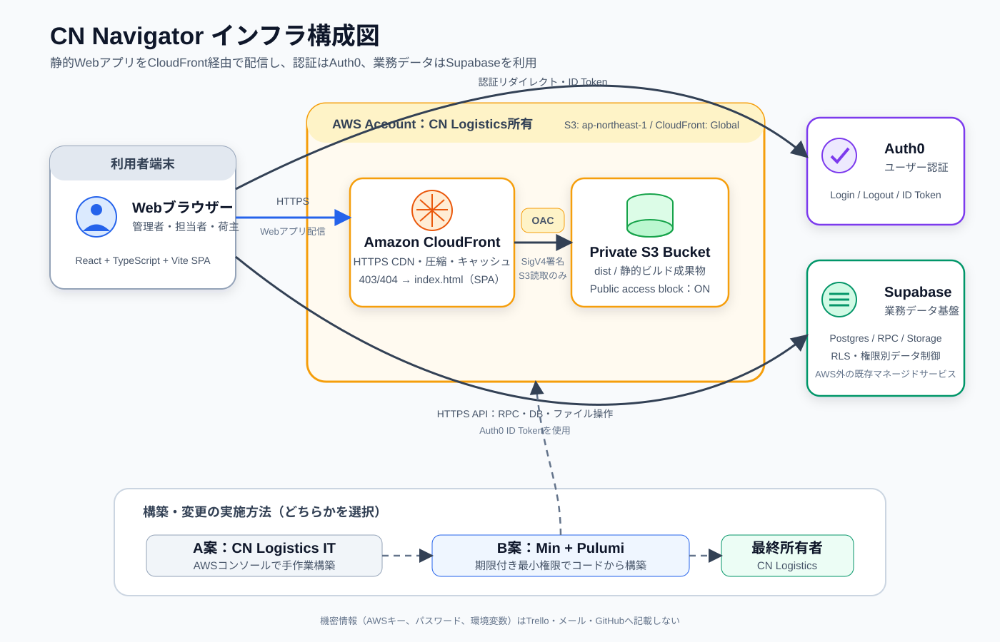

# cn-navigator-infra

Pulumi TypeScript infrastructure for hosting the `cn-navigator` Vite build on S3 behind CloudFront.

## Architecture



The Vite single-page application is served from a private S3 bucket through
CloudFront and Origin Access Control. Authentication is handled by Auth0, while
application data, RPCs, and file storage remain in Supabase.

## Prerequisites

- Node.js and npm
- Pulumi CLI
- AWS credentials for the target account

## Usage

```sh
make install
make stack STACK=dev
make config STACK=dev AWS_REGION=ap-northeast-1 SITE_PATH=../cn-navigator/dist
make deploy STACK=dev
```

The default AWS profile is `cn-logistics`. Override it for any make target with:

```sh
make preview AWS_PROFILE=other-profile
```

The default Pulumi owner is the individual account `ilovelili`, so `make stack`
selects or creates `ilovelili/dev` by default. Override it with:

```sh
make stack PULUMI_OWNER=other-account-or-org STACK=prod
```

Useful outputs:

```sh
make outputs STACK=dev
```

The default app source directory is `../cn-navigator`, and the default deployed artifact path is `../cn-navigator/dist`.

## Custom domain

To serve a stack through a custom domain, configure both the domain name and an
issued ACM certificate ARN. CloudFront certificates must be created in
`us-east-1`.

```sh
make deploy STACK=prod
```

`CUSTOM_DOMAIN` defaults to `navigator.cnlogistics.co.jp`, and
`CERTIFICATE_ARN` defaults to the production certificate in `us-east-1`.
Override both values when deploying to a different AWS account or hostname.

After the CloudFront update finishes, create the following record with the
external DNS provider and retain the separate ACM validation CNAME for
automatic certificate renewal:

```text
Type:  CNAME
Name:  navigator
Value: dgbbs9szog7eu.cloudfront.net
```